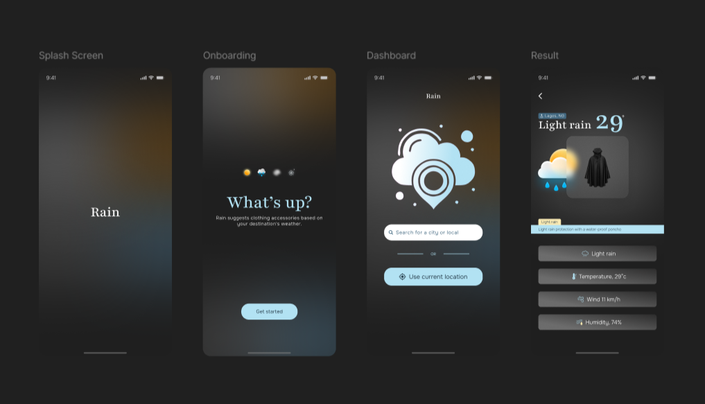
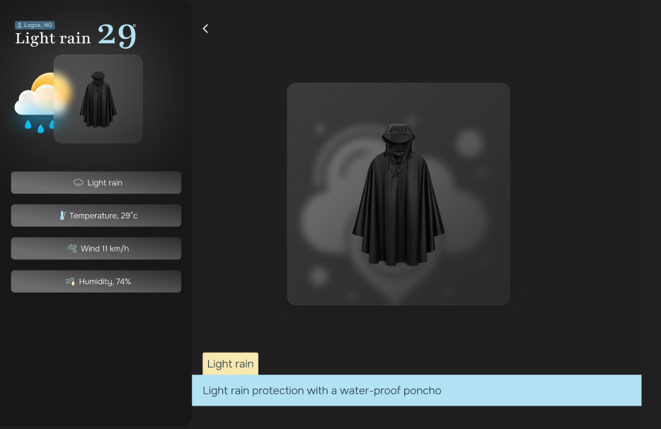

# RAIN APP
#### Rain app suggests clothing accessories based on your destination's weather.

#### [View prototype](https://www.figma.com/proto/UiFTfYDbsFWgF8lPSfidqO/Rain?page-id=0%3A1&node-id=161-4213&node-type=canvas&viewport=780%2C313%2C0.06&t=dJomzIEZJ1T7Eflp-1&scaling=scale-down&content-scaling=fixed&starting-point-node-id=161%3A4229&share=1&show-proto-sidebar=1) | Password: "Rain_ALX"
#### [View project summary](https://docs.google.com/document/d/1zqJfSA-Xt9l1sAYvxJFAMHUSJfFo4DCrO0yyE2sktv8/edit?usp=sharing)
  

# User instructions
The app doesn't require any form of authentication. 
Once you click on "Get started" you will see the rain dashboard where you can either
- search for a city or local, or 
- use your current location   
to get accessory recommendations based on the weather results. 
  

#### [Visit Rain](https://rain-app.vercel.app/)